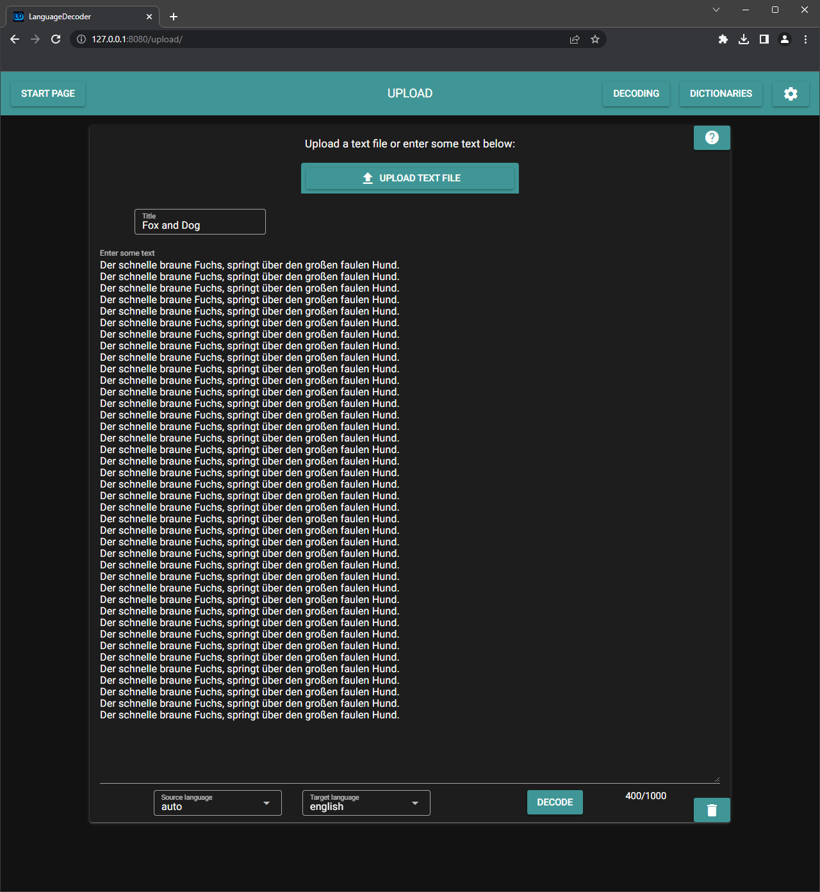
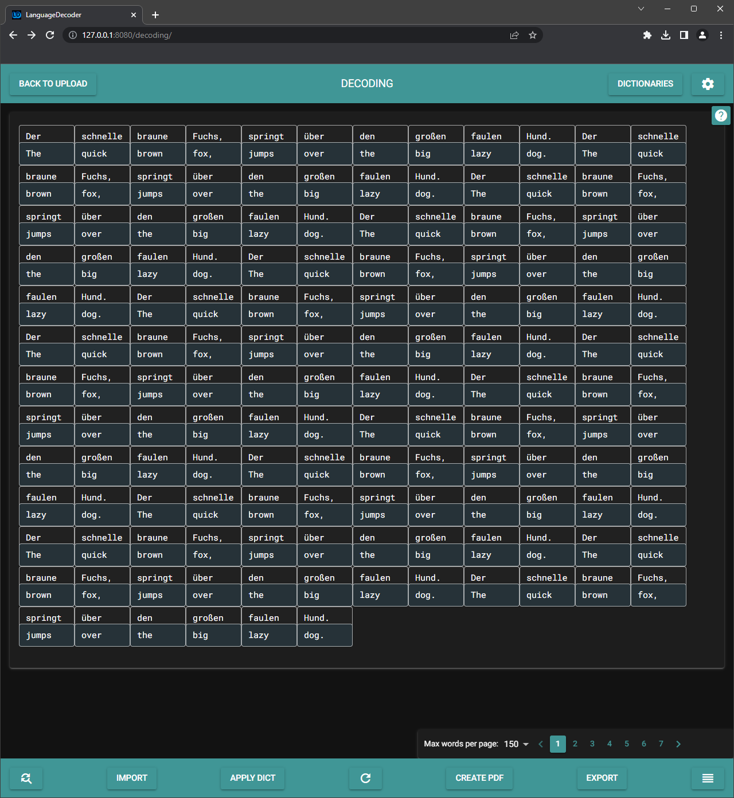
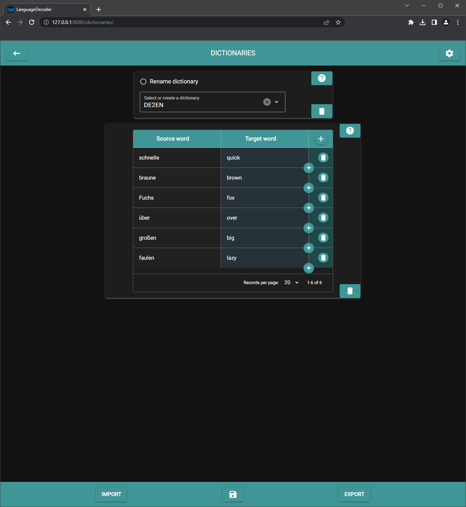
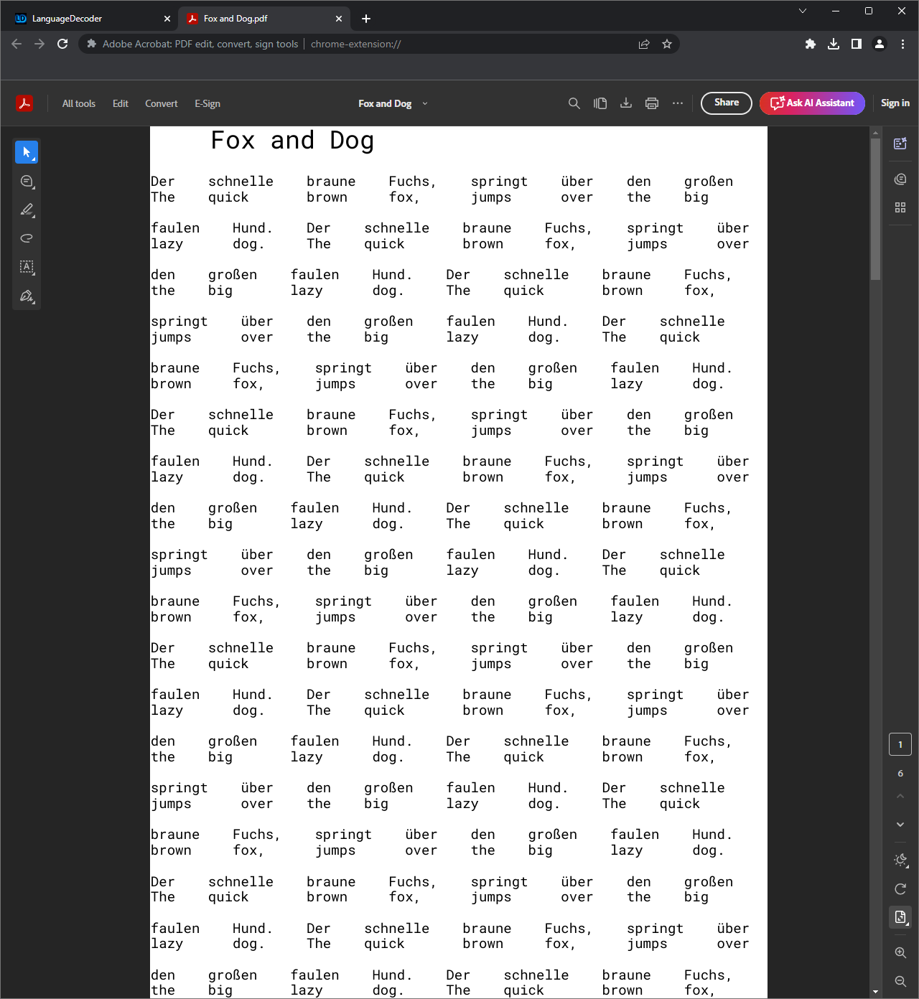

[](https://app.codacy.com/gh/PumucklRandom/language-decoder/dashboard?utm_source=gh&utm_medium=referral&utm_content=&utm_campaign=Badge_grade)

## Language Decoder

The LanguageDecoder translates a given text from the source language to a
desired target language word by word (decoding). Therefore, the Google
translator is used in the backend. To improve the translation, a dictionary can
be created to automatically correct common translation errors. Afterwards, the
decoded text can be exported to a PDF file.

The LanguageDecoder can also be used to create language learning lessons based
on the
[Birkenbihl approach.](https://blog.brain-friendly.com/easy-language-learning-by-vera-f-birkenbihl-the-decoding-method/)






### Usage

To use the LanguageDecoder you can either clone the repo:

```
git clone https://github.com/PumucklRandom/language-decoder.git
cd language-decoder
```

open terminal and run:

```
pipenv install
python ./__main__.py
```

or just download the LanguageDecoder.zip, extract the files and execute the
LanguageDecoder.exe.

With the build.py file you can create your on local desktop application.

The LanguageDecoder requires a common modern browser such as Edge, Chrome or
Firefox and a free port on localhost port 8080 (127.0.0.1:8080).
If this port is occupied, the IP address and the port can be adjusted as
desired in the config file. (language_decoder/backend/config/config.yml)

### Known issues

Windows Security blocks desktop application. (Workaround: Run application as
admin)\
Desktop application can't download files.

### Credits

[Nicegui](https://nicegui.io/) for the grafical user interface\
[Deep Translator](https://github.com/nidhaloff/deep-translator/) for the
language translation\
[FPDF2](https://github.com/py-pdf/fpdf2/) for the pdf creation\
[TextStudio](https://www.textstudio.com/) for the application icon
